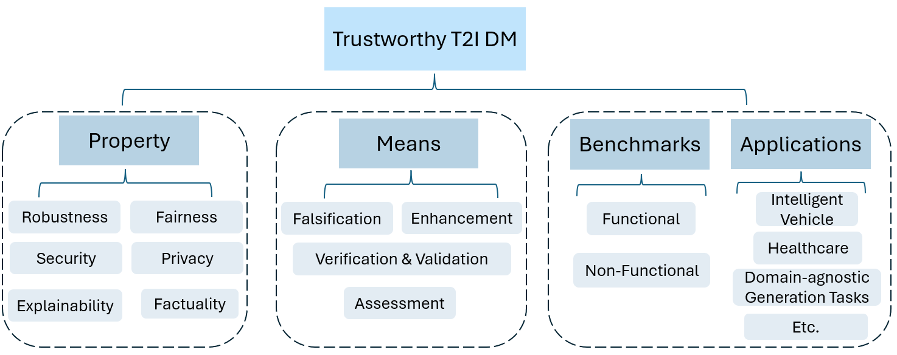

# Trustworthy Text-to-Image Diffusion Models: A Timely and Focused Survey

A curated list of papers concerning Trustworthy Text-to-Image Diffusion Models.


> [Yi Zhang](https://scholar.google.com/citations?user=9E8XJ54AAAAJ&hl=en), [Xingyu Zhao*](https://scholar.google.com/citations?user=SzEBdA8AAAAJ&hl=en), [Zhen Chen](https://scholar.google.com/citations?hl=en&user=Ezm8UAQAAAAJ), [Chih-Hong Cheng](https://scholar.google.com/citations?hl=en&user=e3RTgfMAAAAJ), [Wenjie Ruan](https://scholar.google.com/citations?user=VTASFGEAAAAJ&hl=en),
[Xiaowei Huang](https://scholar.google.com/citations?user=X4fLCCIAAAAJ&hl=en), [Dezong Zhao](https://scholar.google.com/citations?hl=en&user=ydq4ZjYAAAAJ), [David Flynn](https://scholar.google.com/citations?hl=en&user=EeSDHVkAAAAJ),
[Siddartha Khastgir](https://scholar.google.com/citations?hl=en&user=r3ldU6sAAAAJ)
>
> *Corresponding Author


## Overview

<p align="center">
    
</p>


### Abstract
> Text-to-image (T2I) Diffusion Models (DMs) have made remarkable strides in creating high-fidelity images. The ability to generate high-quality images from simple natural language descriptions could potentially bring tremendous benefits to various real-world applications, such as intelligent vehicles, healthcare, and a series of domain-agnostic generation tasks. DMs are a class of probabilistic generative models that generate samples by applying a noise injection process followed by a reverse procedure \cite{ho2020denoising}. T2I DMs are specific implementations that guide image generation using descriptive text as a guidance signal. Models such as Stability AI’s Stable Diffusion (SD) and Google’s Imagen, trained on large-scale datasets of annotated text-image pairs, are capable of producing photo-realistic images. Commercial products like DALL-E 3 and Midjourney have showcased impressive capabilities in a wide range of T2I applications, advancing the field.


### Citation

```
coming
```


## Related surveys

* [Advancements in Generative Modeling: A Comprehensive Survey of GANs and Diffusion Models for Text-to-Image Synthesis and Manipulation](https://ieeexplore.ieee.org/abstract/document/10481956)
  <details>
  <summary> Priyanshu Deshmukh et al.  
      <em>2024 IEEE International Students' Conference on Electrical, Electronics and Computer Science (SCEECS)</em>, 2024 </summary>
    This review paper explores the two main strategies in Gen AI: GANs and Diffusion models. GANs involve the generation and discrimination of data, with a focus on their architecture, optimization techniques, and challenges like mode disintegration and instability. Diffusion models, a blend of noise diffusion and denoising, aim to rewrite the generative narrative with their high-constancy photo generation, precise distribution coverage, and scalability benefits. The paper also highlights the interaction between GANs and Diffusion models, highlighting scenarios where each model is preferred and where collaboration unlocks synergistic capabilities. The review provides a roadmap for future research, identifying key areas for exploration and development in the ever-evolving landscape of generative modeling. The manuscript serves as a comprehensive manual for researchers/practitioners looking to navigate the complex world of GANs and Diffusion strategies.
  </details>
* [A Survey of Text-to-Image Diffusion Models in Generative AI](https://ieeexplore.ieee.org/abstract/document/10463372)
  <details>
  <summary> Siddharth Kandwal et al.  
      <em> 2024 14th International Conference on Cloud Computing, Data Science & Engineering (Confluence)</em>, 2024 </summary>
    From dreamscapes to photorealistic portraits, text-to-image generation pushes the boundaries of AI creativity. This survey navigates diverse techniques, such as GANs, VAEs, and Diffusion models, uncovering their potential for transforming textual descriptions into captivating visuals. These models have significantly advanced the field, but they are not without their limitations. One notable issue is data bias, which could potentially lead to a deficiency in variety and cultural awareness in the produced visuals. Furthermore, recognising the significance of mitigating data bias in generative models, this report offers insights and strategies to address this pressing issue. It explores approaches that leverage inclusive datasets, fairness-aware training techniques, and ethical considerations. These methods aim to bridge the gap between the technological advancements in image generation and the imperative need for inclusivity and cultural sensitivity.
  </details>
  
* [Controllable Generation with Text-to-Image Diffusion Models: A Survey](https://arxiv.org/pdf/2403.04279)
  <details>
  <summary> Pu Cao et al.  
      <em> IEEE TRANSACTIONS ON PATTERN ANALYSIS AND MACHINE INTELLIGENCE</em>, 2024 </summary>
    In the rapidly advancing realm of visual generation, diffusion models have revolutionized the landscape, marking a significant shift in capabilities with their impressive text-guided generative functions. However, relying solely on text for conditioning these models does not fully cater to the varied and complex requirements of different applications and scenarios. Acknowledging this shortfall, a variety of studies aim to control pre-trained text-to-image (T2I) models to support novel conditions. In this survey, we undertake a thorough review of the literature on controllable generation with T2I diffusion models, covering both the theoretical foundations and practical advancements in this domain. Our review begins with a brief introduction to the basics of denoising diffusion probabilistic models (DDPMs) and widely used T2I diffusion models. We then reveal the controlling mechanisms of diffusion models, theoretically analyzing how novel conditions are introduced into the denoising process for conditional generation. Additionally, we offer a detailed overview of research in this area, organizing it into distinct categories from the condition perspective: generation with specific conditions, generation with multiple conditions, and universal controllable generation. For an exhaustive list of the controllable generation literature surveyed, please refer to our curated repository at https://github.com/PRIV-Creation/Awesome-Controllable-T2I-Diffusion-Models.
  </details>
  
* [A Comprehensive Survey of Text Encoders for Text-to-Image Diffusion Models](https://publications.eai.eu/index.php/airo/article/view/5566)
  <details>
  <summary> Shun Fang et al.  
      <em>EAI Endorsed Transactions on AI and Robotics, 2024</em>, 2024 </summary>
    In this comprehensive survey, we delve into the realm of text encoders for text-to-image diffusion models, focusing on the principles, challenges, and opportunities associated with these encoders. We explore the state-of-the-art models, including BERT, T5-XXL, and CLIP, that have revolutionized the way we approach language understanding and cross-modal interactions. These models, with their unique architectures and training techniques, enable remarkable capabilities in generating images from textual descriptions. However, they also face limitations and challenges, such as computational complexity and data scarcity. We discuss these issues and highlight potential opportunities for further research. By providing a comprehensive overview, this survey aims to contribute to the ongoing development of text-to-image diffusion models, enabling more accurate and efficient image generation from textual inputs.
  </details>
* [Attacks and Defenses for Generative Diffusion Models: A Comprehensive Survey](https://arxiv.org/abs/2408.03400)
  <details>
  <summary> Vu Tuan Truong et al.  
      <em>Arxiv</em>, 2024 </summary>
    Diffusion models (DMs) have achieved state-of-the-art performance on various generative tasks such as image synthesis, text-to-image, and text-guided image-to-image generation. However, the more powerful the DMs, the more harmful they potentially are. Recent studies have shown that DMs are prone to a wide range of attacks, including adversarial attacks, membership inference, backdoor injection, and various multi-modal threats. Since numerous pre-trained DMs are published widely on the Internet, potential threats from these attacks are especially detrimental to the society, making DM-related security a worth investigating topic. Therefore, in this paper, we conduct a comprehensive survey on the security aspect of DMs, focusing on various attack and defense methods for DMs. First, we present crucial knowledge of DMs with five main types of DMs, including denoising diffusion probabilistic models, denoising diffusion implicit models, noise conditioned score networks, stochastic differential equations, and multi-modal conditional DMs. We further survey a variety of recent studies investigating different types of attacks that exploit the vulnerabilities of DMs. Then, we thoroughly review potential countermeasures to mitigate each of the presented threats. Finally, we discuss open challenges of DM-related security and envision certain research directions for this topic.
  </details>


## Background (2018)

* [Towards better understanding of gradient-based attribution methods for Deep Neural Networks](https://openreview.net/forum?id=Sy21R9JAW)
  <details>
  <summary> M. Ancona et al.
      <em>International Conference on Learning Representations (ICLR)</em>, 2018 </summary>
    Understanding the flow of information in Deep Neural Networks (DNNs) is a challenging problem that has gain increasing attention over the last few years. While several methods have been proposed to explain network predictions, there have been only a few attempts to compare them from a theoretical perspective. What is more, no exhaustive empirical comparison has been performed in the past. In this work we analyze four gradient-based attribution methods and formally prove conditions of equivalence and approximation between them. By reformulating two of these methods, we construct a unified framework which enables a direct comparison, as well as an easier implementation. Finally, we propose a novel evaluation metric, called Sensitivity-n and test the gradient-based attribution methods alongside with a simple perturbation-based attribution method on several datasets in the domains of image and text classification, using various network architectures.
  </details>

## Robustness

* [Evaluating the Robustness of Text-to-image Diffusion Models against Real-world Attacks](https://arxiv.org/abs/2306.13103)
  <details>
  <summary> Hongcheng Gao et al. 
      <em>Arxiv</em>, 2023 </summary>
    Text-to-image (T2I) diffusion models (DMs) have shown promise in generating high-quality images from textual descriptions. The real-world applications of these models require particular attention to their safety and fidelity, but this has not been sufficiently explored. One fundamental question is whether existing T2I DMs are robust against variations over input texts. To answer it, this work provides the first robustness evaluation of T2I DMs against real-world attacks. Unlike prior studies that focus on malicious attacks involving apocryphal alterations to the input texts, we consider an attack space spanned by realistic errors (e.g., typo, glyph, phonetic) that humans can make, to ensure semantic consistency. Given the inherent randomness of the generation process, we develop novel distribution-based attack objectives to mislead T2I DMs. We perform attacks in a black-box manner without any knowledge of the model. Extensive experiments demonstrate the effectiveness of our method for attacking popular T2I DMs and simultaneously reveal their non-trivial robustness issues. Moreover, we provide an in-depth analysis of our method to show that it is not designed to attack the text encoder in T2I DMs solely.
  </details>
* [A Pilot Study of Query-Free Adversarial Attack Against Stable Diffusion](https://openaccess.thecvf.com/content/CVPR2023W/AML/html/Zhuang_A_Pilot_Study_of_Query-Free_Adversarial_Attack_Against_Stable_Diffusion_CVPRW_2023_paper.html)
  <details>
  <summary> Haomin Zhuang et al. 
      <em>CVPR 2023 </em>, 2023 </summary>
    Despite the record-breaking performance in Text-to-Image (T2I) generation by Stable Diffusion, less research attention is paid to its adversarial robustness. In this work, we study the problem of adversarial attack generation for Stable Diffusion and ask if an adversarial text prompt can be obtained even in the absence of end-to-end model queries. We call the resulting problem 'query-free attack generation'. To resolve this problem, we show that the vulnerability of T2I models is rooted in the lack of robustness of text encoders, e.g., the CLIP text encoder used for attacking Stable Diffusion. Based on such insight, we propose both untargeted and targeted query-free attacks, where the former is built on the most influential dimensions in the text embedding space, which we call steerable key dimensions. By leveraging the proposed attacks, we empirically show that only a five-character perturbation to the text prompt is able to cause the significant content shift of synthesized images using Stable Diffusion. Moreover, we show that the proposed target attack can precisely steer the diffusion model to scrub the targeted image content without causing much change in untargeted image content.
  </details>
  
* [RIATIG: Reliable and Imperceptible Adversarial Text-to-Image Generation With Natural Prompts](https://openaccess.thecvf.com/content/CVPR2023/html/Liu_RIATIG_Reliable_and_Imperceptible_Adversarial_Text-to-Image_Generation_With_Natural_Prompts_CVPR_2023_paper.html?ref=https://githubhelp.com)
  <details>
  <summary> Han Liu et al. 
      <em>CVPR 2023</em>, 2023 </summary>
    The field of text-to-image generation has made remarkable strides in creating high-fidelity and photorealistic images. As this technology gains popularity, there is a growing concern about its potential security risks. However, there has been limited exploration into the robustness of these models from an adversarial perspective. Existing research has primarily focused on untargeted settings, and lacks holistic consideration for reliability (attack success rate) and stealthiness (imperceptibility). In this paper, we propose RIATIG, a reliable and imperceptible adversarial attack against text-to-image models via inconspicuous examples. By formulating the example crafting as an optimization process and solving it using a genetic-based method, our proposed attack can generate imperceptible prompts for text-to-image generation models in a reliable way. Evaluation of six popular text-to-image generation models demonstrates the efficiency and stealthiness of our attack in both white-box and black-box settings. To allow the community to build on top of our findings, we've made the artifacts available.
  </details>
* [Stable Diffusion is Unstable](https://proceedings.neurips.cc/paper_files/paper/2023/hash/b733cdd80ed2ae7e3156d8c33108c5d5-Abstract-Conference.html)
  <details>
  <summary> Chengbin Du et al. 
      <em>Advances in Neural Information Processing Systems 36 (NeurIPS 2023) </em>, 2023 </summary>
    Recently, text-to-image models have been thriving. Despite their powerful generative capacity, our research has uncovered a lack of robustness in this generation process. Specifically, the introduction of small perturbations to the text prompts can result in the blending of primary subjects with other categories or their complete disappearance in the generated images. In this paper, we propose Auto-attack on Text-to-image Models (ATM), a gradient-based approach, to effectively and efficiently generate such perturbations. By learning a Gumbel Softmax distribution, we can make the discrete process of word replacement or extension continuous, thus ensuring the differentiability of the perturbation generation. Once the distribution is learned, ATM can sample multiple attack samples simultaneously. These attack samples can prevent the generative model from generating the desired subjects without tampering with the category keywords in the prompt. ATM has achieved a 91.1\% success rate in short-text attacks and an 81.2\% success rate in long-text attacks. Further empirical analysis revealed three attack patterns based on: 1) variability in generation speed, 2) similarity of coarse-grained characteristics, and 3) polysemy of words. The code is available at https://github.com/duchengbin8/StableDiffusionis_Unstable
  </details>
* [Protip: Probabilistic robustness verification on text-to-image diffusion models against stochastic perturbatio](https://arxiv.org/abs/2402.15429)
  <details>
  <summary> Yi. Zhang et al. 
      <em>ECCV 2024</em>, 2024 </summary>
    Text-to-Image (T2I) Diffusion Models (DMs) have shown impressive abilities in generating high-quality images based on simple text descriptions. However, as is common with many Deep Learning (DL) models, DMs are subject to a lack of robustness. While there are attempts to evaluate the robustness of T2I DMs as a binary or worst-case problem, they cannot answer how robust in general the model is whenever an adversarial example (AE) can be found. In this study, we first introduce a probabilistic notion of T2I DMs' robustness; and then establish an efficient framework, ProTIP, to evaluate it with statistical guarantees. The main challenges stem from: i) the high computational cost of the generation process; and ii) determining if a perturbed input is an AE involves comparing two output distributions, which is fundamentally harder compared to other DL tasks like classification where an AE is identified upon misprediction of labels. To tackle the challenges, we employ sequential analysis with efficacy and futility early stopping rules in the statistical testing for identifying AEs, and adaptive concentration inequalities to dynamically determine the "just-right" number of stochastic perturbations whenever the verification target is met. Empirical experiments validate the effectiveness and efficiency of ProTIP over common T2I DMs. Finally, we demonstrate an application of ProTIP to rank commonly used defence methods.
  </details>
* [On the Multi-modal Vulnerability of Diffusion Models](https://openreview.net/forum?id=FuZjlzR7kT)
  <details>
  <summary> Dingcheng Yang et al. 
      <em>ICML 2024 TiFA Workshop</em>, 2024 </summary>
    Diffusion models have been widely deployed in various image generation tasks, demonstrating an extraordinary connection between image and text modalities. Although prior studies have explored the vulnerability of diffusion models from the perspectives of text and image modalities separately, the current research landscape has not yet thoroughly investigated the vulnerabilities that arise from the integration of multiple modalities, specifically through the joint analysis of textual and visual features. In this paper, we first visualize both text and image feature space embedded by diffusion models and observe a significant difference, i.e., the prompts are embedded chaotically in the text feature space, while in the image feature space they are clustered according to their subjects. Based on this observation, we propose MMP-Attack, which leverages multi-modal priors (MMP) to manipulate the generation results of diffusion models by appending a specific suffix to the original prompt. Specifically, our goal is to induce diffusion models to generate a specific object while simultaneously eliminating the original object. Our MMP-Attack shows a notable advantage over existing studies with superior manipulation capability and efficiency. Our code is publicly available at \url{https://github.com/ydc123/MMP-Attack}.
  </details>
  
* [Discovering Failure Modes of Text-guided Diffusion Models via Adversarial Search](https://arxiv.org/abs/2306.00974)
  <details>
  <summary> Qihao Liu et al. 
      <em>ICLR 2024 poster</em>, 2024 </summary>
    Text-guided diffusion models (TDMs) are widely applied but can fail unexpectedly. Common failures include: (i) natural-looking text prompts generating images with the wrong content, or (ii) different random samples of the latent variables that generate vastly different, and even unrelated, outputs despite being conditioned on the same text prompt. In this work, we aim to study and understand the failure modes of TDMs in more detail. To achieve this, we propose SAGE, the first adversarial search method on TDMs that systematically explores the discrete prompt space and the high-dimensional latent space, to automatically discover undesirable behaviors and failure cases in image generation. We use image classifiers as surrogate loss functions during searching, and employ human inspections to validate the identified failures. For the first time, our method enables efficient exploration of both the discrete and intricate human language space and the challenging latent space, overcoming the gradient vanishing problem. Then, we demonstrate the effectiveness of SAGE on five widely used generative models and reveal four typical failure modes that have not been systematically studied before: (1) We find a variety of natural text prompts that generate images failing to capture the semantics of input texts. We further discuss the underlying causes and potential solutions based on the results. (2) We find regions in the latent space that lead to distorted images independent of the text prompt, suggesting that parts of the latent space are not well-structured. (3) We also find latent samples that result in natural-looking images unrelated to the text prompt, implying a possible misalignment between the latent and prompt spaces. (4) By appending a single adversarial token embedding to any input prompts, we can generate a variety of specified target objects, with minimal impact on CLIP scores, demonstrating the fragility of language representations.
  </details>
  

## Fairness

* [How well can Text-to-Image Generative Models understand Ethical Natural Language Interventions?](https://arxiv.org/abs/2210.15230)
  <details>
  <summary> Hritik Bansal et al. 
      <em> Proceedings of the 2022 Conference on Empirical Methods in Natural Language Processing</em>, 2022 </summary>
        Text-to-image generative models have achieved unprecedented success in generating high-quality images based on natural language descriptions. However, it is shown that these models tend to favor specific social groups when prompted with neutral text descriptions (e.g., ‘a photo of a lawyer’). Following Zhao et al. (2021), we study the effect on the diversity of the generated images when adding ethical intervention that supports equitable judgment (e.g., ‘if all individuals can be a lawyer irrespective of their gender’) in the input prompts. To this end, we introduce an Ethical NaTural Language Interventions in Text-to-Image GENeration (ENTIGEN) benchmark dataset to evaluate the change in image generations conditional on ethical interventions across three social axes – gender, skin color, and culture. Through CLIP-based and human evaluation on minDALL.E, DALL.E-mini and Stable Diffusion, we find that the model generations cover diverse social groups while preserving the image quality. In some cases, the generations would be anti-stereotypical (e.g., models tend to create images with individuals that are perceived as man when fed with prompts about makeup) in the presence of ethical intervention. Preliminary studies indicate that a large change in the model predictions is triggered by certain phrases such as ‘irrespective of gender’ in the context of gender bias in the ethical interventions. We release code and annotated data at https://github.com/Hritikbansal/entigen_emnlp.
  </details>

* [Exploiting Cultural Biases via Homoglyphs in Text-to-Image Synthesis](https://dl.acm.org/doi/10.1613/jair.1.15388)
  <details>
  <summary> Lukas Struppek et al. 
      <em>Journal of Artificial Intelligence Research</em>, 2024 </summary>
    Auditing fairness of decision-makers is now in high demand. To respond to this social demand, several fairness auditing tools have been developed. The focus of this study is to raise an awareness of the risk of malicious decision-makers who fake fairness by abusing the auditing tools and thereby deceiving the social communities. The question is whether such a fraud of the decision-maker is detectable so that the society can avoid the risk of fake fairness. In this study, we answer this question negatively. We specifically put our focus on a situation where the decision-maker publishes a benchmark dataset as the evidence of his/her fairness and attempts to deceive a person who uses an auditing tool that computes a fairness metric. To assess the (un)detectability of the fraud, we explicitly construct an algorithm, the stealthily biased sampling, that can deliberately construct an evil benchmark dataset via subsampling. We show that the fraud made by the stealthily based sampling is indeed difficult to detect both theoretically and empirically.
  </details>
  
* [Fair Diffusion: Instructing Text-to-Image Generation Models on Fairness](https://arxiv.org/abs/2302.10893)
  <details>
  <summary> Felix Friedrich et al. 
      <em>Arxiv</em>, 2023 </summary>
    Generative AI models have recently achieved astonishing results in quality and are consequently employed in a fast-growing number of applications. However, since they are highly data-driven, relying on billion-sized datasets randomly scraped from the internet, they also suffer from degenerated and biased human behavior, as we demonstrate. In fact, they may even reinforce such biases. To not only uncover but also combat these undesired effects, we present a novel strategy, called Fair Diffusion, to attenuate biases after the deployment of generative text-to-image models. Specifically, we demonstrate shifting a bias, based on human instructions, in any direction yielding arbitrarily new proportions for, e.g., identity groups. As our empirical evaluation demonstrates, this introduced control enables instructing generative image models on fairness, with no data filtering and additional training required.
  </details>
  
* [ITI-GEN: Inclusive Text-to-Image Generation](https://openaccess.thecvf.com/content/ICCV2023/html/Zhang_ITI-GEN_Inclusive_Text-to-Image_Generation_ICCV_2023_paper.html)
  <details>
  <summary> Cheng Zhang et al. 
      <em>ICCV 2023</em>, 2023 </summary>
    Text-to-image generative models often reflect the biases of the training data, leading to unequal representations of underrepresented groups. This study investigates inclusive text-to-image generative models that generate images based on human-written prompts and ensure the resulting images are uniformly distributed across attributes of interest. Unfortunately, directly expressing the desired attributes in the prompt often leads to sub-optimal results due to linguistic ambiguity or model misrepresentation. Hence, this paper proposes a drastically different approach that adheres to the maxim that "a picture is worth a thousand words". We show that, for some attributes, images can represent concepts more expressively than text. For instance, categories of skin tones are typically hard to specify by text but can be easily represented by example images. Building upon these insights, we propose a novel approach, ITI-GEN, that leverages readily available reference images for Inclusive Text-to-Image GENeration. The key idea is learning a set of prompt embeddings to generate images that can effectively represent all desired attribute categories. More importantly, ITI-GEN requires no model fine-tuning, making it computationally efficient to augment existing text-to-image models. Extensive experiments demonstrate that ITI-GEN largely improves over state-of-the-art models to generate inclusive images from a prompt.
  </details>
  
* [De-stereotyping Text-to-image Models through Prompt Tuning](https://openreview.net/forum?id=yNyywJln2R#all)
  <details>
  <summary> Eunji Kim et al. 
      <em>DeployableGenerativeAI</em>, 2023 </summary>
    Recent text-to-image (TTI) generation models have been reported to generate images demographically stereotyped in various sensitive attributes such as gender or race. This may seriously harm the fairness of the generative model to be deployed. We propose a novel and efficient framework to de-stereotype the existing TTI model through soft prompt tuning. Utilizing a newly designed de-stereotyping loss, we train a small number of parameters consisting of the soft prompt. We demonstrate that our framework effectively balances the generated images with respect to sensitive attributes, which can also generalize to unseen text prompts.
  </details>
  
* [Finetuning Text-to-Image Diffusion Models for Fairness](https://openreview.net/forum?id=hnrB5YHoYu)
  <details>
  <summary> Xudong Shen et al. 
      <em>ICLR 2024 oral</em>, 2024 </summary>
    The rapid adoption of text-to-image diffusion models in society underscores an urgent need to address their biases. Without interventions, these biases could propagate a skewed worldview and restrict opportunities for minority groups. In this work, we frame fairness as a distributional alignment problem. Our solution consists of two main technical contributions: (1) a distributional alignment loss that steers specific characteristics of the generated images towards a user-defined target distribution, and (2) adjusted direct finetuning of diffusion model's sampling process (adjusted DFT), which leverages an adjusted gradient to directly optimize losses defined on the generated images. Empirically, our method markedly reduces gender, racial, and their intersectional biases for occupational prompts. Gender bias is significantly reduced even when finetuning just five soft tokens. Crucially, our method supports diverse perspectives of fairness beyond absolute equality, which is demonstrated by controlling age to a 75% young and 25% old distribution while simultaneously debiasing gender and race. Finally, our method is scalable: it can debias multiple concepts at once by simply including these prompts in the finetuning data. We share code and various fair diffusion model adaptors at https://sail-sg.github.io/finetune-fair-diffusion/.
  </details>
  
* [Easily Accessible Text-to-Image Generation Amplifies Demographic Stereotypes at Large Scale](https://dl.acm.org/doi/abs/10.1145/3593013.3594095)
  <details>
  <summary> Federico Bianchi et al. 
      <em>FAccT '23: Proceedings of the 2023 ACM Conference on Fairness, Accountability, and Transparency</em>, FAccT </summary>
    Machine learning models that convert user-written text descriptions into images are now widely available online and used by millions of users to generate millions of images a day. We investigate the potential for these models to amplify dangerous and complex stereotypes. We find a broad range of ordinary prompts produce stereotypes, including prompts simply mentioning traits, descriptors, occupations, or objects. For example, we find cases of prompting for basic traits or social roles resulting in images reinforcing whiteness as ideal, prompting for occupations resulting in amplification of racial and gender disparities, and prompting for objects resulting in reification of American norms. Stereotypes are present regardless of whether prompts explicitly mention identity and demographic language or avoid such language. Moreover, stereotypes persist despite mitigation strategies; neither user attempts to counter stereotypes by requesting images with specific counter-stereotypes nor institutional attempts to add system “guardrails” have prevented the perpetuation of stereotypes. Our analysis justifies concerns regarding the impacts of today’s models, presenting striking exemplars, and connecting these findings with deep insights into harms drawn from social scientific and humanist disciplines. This work contributes to the effort to shed light on the uniquely complex biases in language-vision models and demonstrates the ways that the mass deployment of text-to-image generation models results in mass dissemination of stereotypes and resulting harms.
  </details>
  
* [Stable Bias: Evaluating Societal Representations in Diffusion Models](https://proceedings.neurips.cc/paper_files/paper/2023/hash/b01153e7112b347d8ed54f317840d8af-Abstract-Datasets_and_Benchmarks.html)
  <details>
  <summary> Sasha Luccioni et al. 
      <em>Advances in Neural Information Processing Systems 36 (NeurIPS 2023) </em>, 2023 </summary>
    As machine learning-enabled Text-to-Image (TTI) systems are becoming increasingly prevalent and seeing growing adoption as commercial services, characterizing the social biases they exhibit is a necessary first step to lowering their risk of discriminatory outcomes. This evaluation, however, is made more difficult by the synthetic nature of these systems’ outputs: common definitions of diversity are grounded in social categories of people living in the world, whereas the artificial depictions of fictive humans created by these systems have no inherent gender or ethnicity. To address this need, we propose a new method for exploring the social biases in TTI systems. Our approach relies on characterizing the variation in generated images triggered by enumerating gender and ethnicity markers in the prompts, and comparing it to the variation engendered by spanning different professions. This allows us to (1) identify specific bias trends, (2) provide targeted scores to directly compare models in terms of diversity and representation, and (3) jointly model interdependent social variables to support a multidimensional analysis. We leverage this method to analyze images generated by 3 popular TTI systems (Dall·E 2 , Stable Diffusion v 1.4 and 2) and find that while all of their outputs show correlations with US labor demographics, they also consistently under-represent marginalized identities to different extents. We also release the datasets and low-code interactive bias exploration platforms developed forthis work, as well as the necessary tools to similarly evaluate additional TTI systems.
  </details>


## Security

* [Rickrolling the Artist: Injecting Backdoors into Text Encoders for Text-to-Image Synthesis](https://openaccess.thecvf.com/content/ICCV2023/html/Struppek_Rickrolling_the_Artist_Injecting_Backdoors_into_Text_Encoders_for_Text-to-Image_ICCV_2023_paper.html)
  <details>
  <summary> Lukas Struppek et al. 
      <em> ICCV 2023</em>, 2023 </summary>
        While text-to-image synthesis currently enjoys great popularity among researchers and the general public, the security of these models has been neglected so far. Many text-guided image generation models rely on pre-trained text encoders from external sources, and their users trust that the retrieved models will behave as promised. Unfortunately, this might not be the case. We introduce backdoor attacks against text-guided generative models and demonstrate that their text encoders pose a major tampering risk. Our attacks only slightly alter an encoder so that no suspicious model behavior is apparent for image generations with clean prompts. By then inserting a single character trigger into the prompt, e.g., a non-Latin character or emoji, the adversary can trigger the model to either generate images with pre-defined attributes or images following a hidden, potentially malicious description. We empirically demonstrate the high effectiveness of our attacks on Stable Diffusion and highlight that the injection process of a single backdoor takes less than two minutes. Besides phrasing our approach solely as an attack, it can also force an encoder to forget phrases related to certain concepts, such as nudity or violence, and help to make image generation safer.
  </details>

* [Text-to-Image Diffusion Models can be Easily Backdoored through Multimodal Data Poisoning](https://dl.acm.org/doi/abs/10.1145/3581783.3612108)
  <details>
  <summary> Shengfang Zhai et al. 
      <em> MM '23: Proceedings of the 31st ACM International Conference on Multimedia</em>, 2023 </summary>
    With the help of conditioning mechanisms, the state-of-the-art diffusion models have achieved tremendous success in guided image generation, particularly in text-to-image synthesis. To gain a better understanding of the training process and potential risks of text-to-image synthesis, we perform a systematic investigation of backdoor attack on text-to-image diffusion models and propose BadT2I, a general multimodal backdoor attack framework that tampers with image synthesis in diverse semantic levels. Specifically, we perform backdoor attacks on three levels of the vision semantics: Pixel-Backdoor, Object-Backdoor and Style-Backdoor. By utilizing a regularization loss, our methods efficiently inject backdoors into a large-scale text-to-image diffusion model while preserving its utility with benign inputs. We conduct empirical experiments on Stable Diffusion, the widely-used text-to-image diffusion model, demonstrating that the large-scale diffusion model can be easily backdoored within a few fine-tuning steps. We conduct additional experiments to explore the impact of different types of textual triggers, as well as the backdoor persistence during further training, providing insights for the development of backdoor defense methods. Besides, our investigation may contribute to the copyright protection of text-to-image models in the future. Our Code: https://github.com/sf-zhai/BadT2I.
  </details>


* [T2IShield: Defending Against Backdoors on Text-to-Image Diffusion Models](https://arxiv.org/abs/2407.04215)
  <details>
  <summary> Zhongqi Wang et al. 
      <em> ECCV 2024</em>, 2024 </summary>
    While text-to-image diffusion models demonstrate impressive generation capabilities, they also exhibit vulnerability to backdoor attacks, which involve the manipulation of model outputs through malicious triggers. In this paper, for the first time, we propose a comprehensive defense method named T2IShield to detect, localize, and mitigate such attacks. Specifically, we find the "Assimilation Phenomenon" on the cross-attention maps caused by the backdoor trigger. Based on this key insight, we propose two effective backdoor detection methods: Frobenius Norm Threshold Truncation and Covariance Discriminant Analysis. Besides, we introduce a binary-search approach to localize the trigger within a backdoor sample and assess the efficacy of existing concept editing methods in mitigating backdoor attacks. Empirical evaluations on two advanced backdoor attack scenarios show the effectiveness of our proposed defense method. For backdoor sample detection, T2IShield achieves a detection F1 score of 88.9% with low computational cost. Furthermore, T2IShield achieves a localization F1 score of 86.4% and invalidates 99% poisoned samples. Codes are released at this https URL.
  </details>


* [BAGM: A Backdoor Attack for Manipulating Text-to-Image Generative Models](https://ieeexplore.ieee.org/abstract/document/10494544)
  <details>
  <summary> Jordan Vice et al. 
      <em> IEEE Transactions on Information Forensics and Security</em>, 2024 </summary>
     The rise in popularity of text-to-image generative artificial intelligence (AI) has attracted widespread public interest. We demonstrate that this technology can be attacked to generate content that subtly manipulates its users. We propose a Backdoor Attack on text-to-image Generative Models (BAGM), which upon triggering, infuses the generated images with manipulative details that are naturally blended in the content. Our attack is the first to target three popular text-to-image generative models across three stages of the generative process by modifying the behaviour of the embedded tokenizer, the language model or the image generative model. Based on the penetration level, BAGM takes the form of a suite of attacks that are referred to as surface, shallow and deep attacks in this article. Given the existing gap within this domain, we also contribute a comprehensive set of quantitative metrics designed specifically for assessing the effectiveness of backdoor attacks on text-to-image models. The efficacy of BAGM is established by attacking state-of-the-art generative models, using a marketing scenario as the target domain. To that end, we contribute a dataset of branded product images. Our embedded backdoors increase the bias towards the target outputs by more than five times the usual, without compromising the model robustness or the generated content utility. By exposing generative AI’s vulnerabilities, we encourage researchers to tackle these challenges and practitioners to exercise caution when using pre-trained models. Relevant code and input prompts can be found at https://github.com/JJ-Vice/BAGM , and the dataset is available at: https://ieee-dataport.org/documents/marketable-foods-mf-dataset
  </details>


* [EvilEdit: Backdooring Text-to-Image Diffusion Models in One Second](https://openreview.net/forum?id=ibEaSS6bQn)
  <details>
  <summary> Hao Wang et al. 
      <em> MM2024 Poster</em>, 2024 </summary>
  Text-to-image (T2I) diffusion models enjoy great popularity and many individuals and companies build their applications based on publicly released T2I diffusion models. Previous studies have demonstrated that backdoor attacks can elicit T2I diffusion models to generate unsafe target images through textual triggers. However, existing backdoor attacks typically demand substantial tuning data for poisoning, limiting their practicality and potentially degrading the overall performance of T2I diffusion models. To address these issues, we propose EvilEdit, a training-free and data-free backdoor attack against T2I diffusion models. EvilEdit directly edits the projection matrices in the cross-attention layers to achieve projection alignment between a trigger and the corresponding backdoor target. We preserve the functionality of the backdoored model using a protected whitelist to ensure the semantic of non-trigger words is not accidentally altered by the backdoor. We also propose a visual target attack EvilEdit, enabling adversaries to use specific images as backdoor targets. We conduct empirical experiments on Stable Diffusion and the results demonstrate that the EvilEdit can backdoor T2I diffusion models within one second with up to 100% success rate. Furthermore, our EvilEdit modifies only 2.2% of the parameters and maintains the model’s performance on benign prompts. Our code is available at https://github.com/haowang-cqu/EvilEdit.
  </details>


* [Personalization as a Shortcut for Few-Shot Backdoor Attack against Text-to-Image Diffusion Models](https://ojs.aaai.org/index.php/AAAI/article/view/30110)
  <details>
  <summary> Yihao Huang et al. 
      <em> AAAI 2024</em>, 2024 </summary>
  Although recent personalization methods have democratized high-resolution image synthesis by enabling swift concept acquisition with minimal examples and lightweight computation, they also present an exploitable avenue for highly accessible backdoor attacks. This paper investigates a critical and unexplored aspect of text-to-image (T2I) diffusion models - their potential vulnerability to backdoor attacks via personalization. By studying the prompt processing of popular personalization methods (epitomized by Textual Inversion and DreamBooth), we have devised dedicated personalization-based backdoor attacks according to the different ways of dealing with unseen tokens and divide them into two families: nouveau-token and legacy-token backdoor attacks. In comparison to conventional backdoor attacks involving the fine-tuning of the entire text-to-image diffusion model, our proposed personalization-based backdoor attack method can facilitate more tailored, efficient, and few-shot attacks. Through comprehensive empirical study, we endorse the utilization of the nouveau-token backdoor attack due to its impressive effectiveness, stealthiness, and integrity, markedly outperforming the legacy-token backdoor attack.
  </details>


## Privacy

* [Diffusion Art or Digital Forgery? Investigating Data Replication in Diffusion Models](https://openaccess.thecvf.com/content/CVPR2023/html/Somepalli_Diffusion_Art_or_Digital_Forgery_Investigating_Data_Replication_in_Diffusion_CVPR_2023_paper.html)
  <details>
  <summary> Gowthami Somepalli et al. 
      <em> the IEEE/CVF Conference on Computer Vision and Pattern Recognition (CVPR), 2023</em>, 2023 </summary>
  Cutting-edge diffusion models produce images with high quality and customizability, enabling them to be used for commercial art and graphic design purposes. But do diffusion models create unique works of art, or are they replicating content directly from their training sets? In this work, we study image retrieval frameworks that enable us to compare generated images with training samples and detect when content has been replicated. Applying our frameworks to diffusion models trained on multiple datasets including Oxford flowers, Celeb-A, ImageNet, and LAION, we discuss how factors such as training set size impact rates of content replication. We also identify cases where diffusion models, including the popular Stable Diffusion model, blatantly copy from their training data.
  </details>

* [Understanding and Mitigating Copying in Diffusion Models](https://proceedings.neurips.cc/paper_files/paper/2023/hash/9521b6e7f33e039e7d92e23f5e37bbf4-Abstract-Conference.html)
  <details>
  <summary> Gowthami Somepalli et al. 
      <em> Advances in Neural Information Processing Systems 36 (NeurIPS 2023) </em>, 2023 </summary>
  Images generated by diffusion models like Stable Diffusion are increasingly widespread. Recent works and even lawsuits have shown that these models are prone to replicating their training data, unbeknownst to the user. In this paper, we first analyze this memorization problem in text-to-image diffusion models. While it is widely believed that duplicated images in the training set are responsible for content replication at inference time, we observe that the text conditioning of the model plays a similarly important role. In fact, we see in our experiments that data replication often does not happen for unconditional models, while it is common in the text-conditional case. Motivated by our findings, we then propose several techniques for reducing data replication at both training and inference time by randomizing and augmenting image captions in the training set. Code is available at https://github.com/somepago/DCR.
  </details>


* [Are Diffusion Models Vulnerable to Membership Inference Attacks?](https://ojs.aaai.org/index.php/AAAI/article/view/30110)
  <details>
  <summary> Jinhao Duan et al. 
      <em> Proceedings of the 40th International Conference on Machine Learning</em>, 2023 </summary>
  Diffusion-based generative models have shown great potential for image synthesis, but there is a lack of research on the security and privacy risks they may pose. In this paper, we investigate the vulnerability of diffusion models to Membership Inference Attacks (MIAs), a common privacy concern. Our results indicate that existing MIAs designed for GANs or VAE are largely ineffective on diffusion models, either due to inapplicable scenarios (e.g., requiring the discriminator of GANs) or inappropriate assumptions (e.g., closer distances between synthetic samples and member samples). To address this gap, we propose Step-wise Error Comparing Membership Inference (SecMI), a query-based MIA that infers memberships by assessing the matching of forward process posterior estimation at each timestep. SecMI follows the common overfitting assumption in MIA where member samples normally have smaller estimation errors, compared with hold-out samples. We consider both the standard diffusion models, e.g., DDPM, and the text-to-image diffusion models, e.g., Latent Diffusion Models and Stable Diffusion. Experimental results demonstrate that our methods precisely infer the membership with high confidence on both of the two scenarios across multiple different datasets. Code is available at https://github.com/jinhaoduan/SecMI.
  </details>


* [Extracting training data from diffusion models](https://dl.acm.org/doi/10.5555/3620237.3620531)
  <details>
  <summary> Nicholas Carlini et al. 
      <em> SEC '23: Proceedings of the 32nd USENIX Conference on Security Symposium</em>, 2023 </summary>
  Image diffusion models such as DALL-E 2, Imagen, and Stable Diffusion have attracted significant attention due to their ability to generate high-quality synthetic images. In this work, we show that diffusion models memorize individual images from their training data and emit them at generation time. With a generate-and-filter pipeline, we extract over a thousand training examples from state-of-the-art models, ranging from photographs of individual people to trademarked company logos. We also train hundreds of diffusion models in various settings to analyze how different modeling and data decisions affect privacy. Overall, our results show that diffusion models are much less private than prior generative models such as GANs, and that mitigating these vulnerabilities may require new advances in privacy-preserving training.
  </details>


* [Detecting, Explaining, and Mitigating Memorization in Diffusion Models](https://openreview.net/forum?id=84n3UwkH7b)
  <details>
  <summary> Yuxin Wen et al. 
      <em> ICLR 2024 oral</em>, 2024 </summary>
  Recent breakthroughs in diffusion models have exhibited exceptional image-generation capabilities. However, studies show that some outputs are merely replications of training data. Such replications present potential legal challenges for model owners, especially when the generated content contains proprietary information. In this work, we introduce a straightforward yet effective method for detecting memorized prompts by inspecting the magnitude of text-conditional predictions. Our proposed method seamlessly integrates without disrupting sampling algorithms, and delivers high accuracy even at the first generation step, with a single generation per prompt. Building on our detection strategy, we unveil an explainable approach that shows the contribution of individual words or tokens to memorization. This offers an interactive medium for users to adjust their prompts. Moreover, we propose two strategies i.e., to mitigate memorization by leveraging the magnitude of text-conditional predictions, either through minimization during inference or filtering during training. These proposed strategies effectively counteract memorization while maintaining high-generation quality. Code is available at https://github.com/YuxinWenRick/diffusion_memorization.
  </details>


* [Unveiling and Mitigating Memorization in Text-to-image Diffusion Models through Cross Attention](https://arxiv.org/abs/2403.11052)
  <details>
  <summary> Jie Ren et al. 
      <em> arXiv 2024</em>, 2024 </summary>
  Recent advancements in text-to-image diffusion models have demonstrated their remarkable capability to generate high-quality images from textual prompts. However, increasing research indicates that these models memorize and replicate images from their training data, raising tremendous concerns about potential copyright infringement and privacy risks. In our study, we provide a novel perspective to understand this memorization phenomenon by examining its relationship with cross-attention mechanisms. We reveal that during memorization, the cross-attention tends to focus disproportionately on the embeddings of specific tokens. The diffusion model is overfitted to these token embeddings, memorizing corresponding training images. To elucidate this phenomenon, we further identify and discuss various intrinsic findings of cross-attention that contribute to memorization. Building on these insights, we introduce an innovative approach to detect and mitigate memorization in diffusion models. The advantage of our proposed method is that it will not compromise the speed of either the training or the inference processes in these models while preserving the quality of generated images. Our code is available at this https URL .
  </details>


* [Towards More Realistic Membership Inference Attacks on Large Diffusion Models](https://ieeexplore.ieee.org/document/10483613)
  <details>
  <summary> Jan Dubiński et al. 
      <em> 2024 IEEE/CVF Winter Conference on Applications of Computer Vision (WACV)</em>, 2024 </summary>
  Generative diffusion models, including Stable Diffusion and Midjourney, can generate visually appealing, diverse, and high-resolution images for various applications. These models are trained on billions of internet-sourced images, raising significant concerns about the potential unauthorized use of copyright-protected images. In this paper, we examine whether it is possible to determine if a specific image was used in the training set, a problem known in the cybersecurity community as a membership inference attack. Our focus is on Stable Diffusion, and we address the challenge of designing a fair evaluation framework to answer this membership question. We propose a new dataset to establish a fair evaluation setup and apply it to Stable Diffusion, also applicable to other generative models. With the proposed dataset, we execute membership attacks (both known and newly introduced). Our research reveals that previously proposed evaluation setups do not provide a full understanding of the effectiveness of membership inference attacks. We conclude that the membership inference attack remains a significant challenge for large diffusion models (often deployed as black-box systems), indicating that related privacy and copyright issues will persist in the foreseeable future.
  </details>


* [Shake to Leak: Fine-tuning Diffusion Models Can Amplify the Generative Privacy Risk](https://ieeexplore.ieee.org/abstract/document/10516655)
  <details>
  <summary> Zhangheng Li et al. 
      <em>  2024 IEEE Conference on Secure and Trustworthy Machine Learning (SaTML)</em>, 2024 </summary>
  While diffusion models have recently demonstrated remarkable progress in generating realistic images, privacy risks also arise: published models or APIs could generate training images and thus leak privacy-sensitive training information. In this paper, we reveal a new risk, Shake-to-Leak (S2L), that fine-tuning the pre-trained models with manipulated data can amplify the existing privacy risks. We demonstrate that S2L could occur in various standard fine-tuning strategies for diffusion models, including concept-injection methods (DreamBooth and Textual Inversion) and parameter-efficient methods (LoRA and Hypernetwork), as well as their combinations. In the worst case, S2L can amplify the state-of-the-art membership inference attack (MIA) on diffusion models by 5.4% (absolute difference) AUC and can increase extracted private samples from almost 0 samples to 16.3 samples on average per target domain. This discovery underscores that the privacy risk with diffusion models is even more severe than previously recognized. Codes are available at https://github.com/VITA-Group/Shake-to-Leak.
  </details>


## Explainability

* [Diffusion Explainer: Visual Explanation for Text-to-image Stable Diffusion](https://arxiv.org/abs/2305.03509)
  <details>
  <summary> Seongmin Lee et al. 
      <em> Arxiv, 2023</em>, 2023 </summary>
  Diffusion-based generative models' impressive ability to create convincing images has captured global attention. However, their complex internal structures and operations often make them difficult for non-experts to understand. We present Diffusion Explainer, the first interactive visualization tool that explains how Stable Diffusion transforms text prompts into images. Diffusion Explainer tightly integrates a visual overview of Stable Diffusion's complex components with detailed explanations of their underlying operations, enabling users to fluidly transition between multiple levels of abstraction through animations and interactive elements. By comparing the evolutions of image representations guided by two related text prompts over refinement timesteps, users can discover the impact of prompts on image generation. Diffusion Explainer runs locally in users' web browsers without the need for installation or specialized hardware, broadening the public's education access to modern AI techniques. Our open-sourced tool is available at: this https URL. A video demo is available at this https URL.
  </details>

* [Prompt-to-Prompt Image Editing with Cross-Attention Control](https://openreview.net/forum?id=_CDixzkzeyb)
  <details>
  <summary> Amir Hertz et al. 
      <em> ICLR 2023 </em>, 2023 </summary>
  Recent large-scale text-driven synthesis diffusion models have attracted much attention thanks to their remarkable capabilities of generating highly diverse images that follow given text prompts. Therefore, it is only natural to build upon these synthesis models to provide text-driven image editing capabilities. However, Editing is challenging for these generative models, since an innate property of an editing technique is to preserve some content from the original image, while in the text-based models, even a small modification of the text prompt often leads to a completely different outcome. State-of-the-art methods mitigate this by requiring the users to provide a spatial mask to localize the edit, hence, ignoring the original structure and content within the masked region. In this paper, we pursue an intuitive prompt-to-prompt editing framework, where the edits are controlled by text only. We analyze a text-conditioned model in depth and observe that the cross-attention layers are the key to controlling the relation between the spatial layout of the image to each word in the prompt. With this observation, we propose to control the attention maps along the diffusion process. Our approach enables us to monitor the synthesis process by editing the textual prompt only, paving the way to a myriad of caption-based editing applications such as localized editing by replacing a word, global editing by adding a specification, and even controlling the extent to which a word is reflected in the image. We present our results over diverse images and prompts with different text-to-image models, demonstrating high-quality synthesis and fidelity to the edited prompts.
  </details>


* [What the DAAM: Interpreting Stable Diffusion Using Cross Attention](https://ojs.aaai.org/index.php/AAAI/article/view/30110)
  <details>
  <summary> Raphael Tang et al. 
      <em> Proceedings of the 61st Annual Meeting of the Association for Computational Linguistics</em>, 2023 </summary>
   Diffusion models are a milestone in text-to-image generation, but they remain poorly understood, lacking interpretability analyses. In this paper, we perform a text-image attribution analysis on Stable Diffusion, a recently open-sourced model. To produce attribution maps, we upscale and aggregate cross-attention maps in the denoising module, naming our method DAAM. We validate it by testing its segmentation ability on nouns, as well as its generalized attribution quality on all parts of speech, rated by humans. On two generated datasets, we attain a competitive 58.8-64.8 mIoU on noun segmentation and fair to good mean opinion scores (3.4-4.2) on generalized attribution. Then, we apply DAAM to study the role of syntax in the pixel space across head–dependent heat map interaction patterns for ten common dependency relations. We show that, for some relations, the head map consistently subsumes the dependent, while the opposite is true for others. Finally, we study several semantic phenomena, focusing on feature entanglement; we find that the presence of cohyponyms worsens generation quality by 9%, and descriptive adjectives attend too broadly. We are the first to interpret large diffusion models from a visuolinguistic perspective, which enables future research. Our code is at https://github.com/castorini/daam.
  </details>


* [From Text to Pixels: Enhancing User Understanding through Text-to-Image Model Explanations](https://dl.acm.org/doi/abs/10.1145/3640543.3645173)
  <details>
  <summary> Nicholas Carlini et al. 
      <em> IUI '24: Proceedings of the 29th International Conference on Intelligent User Interfaces</em>, 2024 </summary>
  Recent progress in Text-to-Image (T2I) models promises transformative applications in art, design, education, medicine, and entertainment. These models, exemplified by Dall-e, Imagen, and Stable Diffusion, have the potential to revolutionize various industries. However, a primary concern is their operation as a ‘black-box’ for many users. Without understanding the underlying mechanics, users are unable to harness the full potential of these models. This study focuses on bridging this gap by developing and evaluating explanation techniques for T2I models, targeting inexperienced end users. While prior works have delved into Explainable AI (XAI) methods for classification or regression tasks, T2I generation poses distinct challenges. Through formative studies with experts, we identified unique explanation goals and subsequently designed tailored explanation strategies. We then empirically evaluated these methods with a cohort of 473 participants from Amazon Mechanical Turk (AMT) across three tasks. Our results highlight users’ ability to learn new keywords through explanations, a preference for example-based explanations, and challenges in comprehending explanations that significantly shift the image's theme. Moreover, findings suggest users benefit from a limited set of concurrent explanations. Our main contributions include a curated dataset for evaluating T2I explainability techniques, insights from a comprehensive AMT user study, and observations critical for future T2I model explainability research.
  </details>


## Factuality

* [Addressing Image Hallucination in Text-to-Image Generation through Factual Image Retrieval](https://arxiv.org/abs/2407.10683)
  <details>
  <summary> Youngsun Lim et al. 
      <em> Arxiv, 2024</em>, 2024 </summary>
  Text-to-image generation has shown remarkable progress with the emergence of diffusion models. However, these models often generate factually inconsistent images, failing to accurately reflect the factual information and common sense conveyed by the input text prompts. We refer to this issue as Image hallucination. Drawing from studies on hallucinations in language models, we classify this problem into three types and propose a methodology that uses factual images retrieved from external sources to generate realistic images. Depending on the nature of the hallucination, we employ off-the-shelf image editing tools, either InstructPix2Pix or IP-Adapter, to leverage factual information from the retrieved image. This approach enables the generation of images that accurately reflect the facts and common sense.
  </details>


